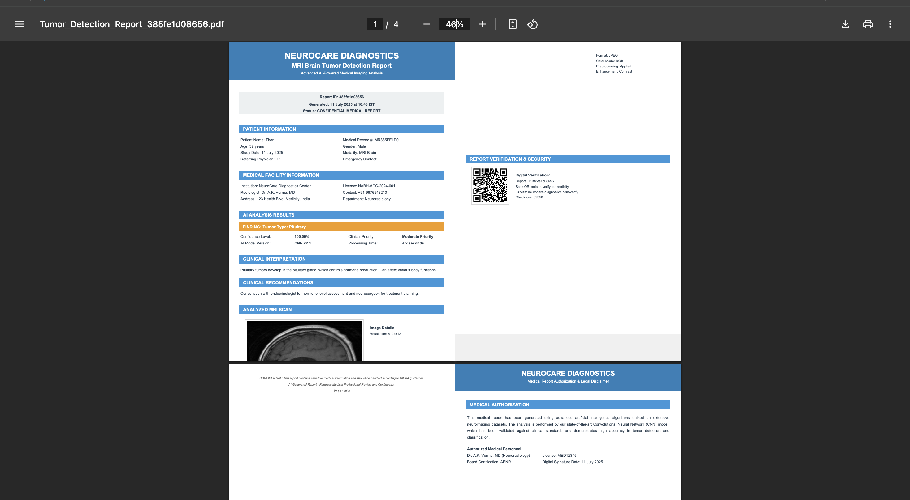

# 🧠 Brain-Tumor-Detection

A full-stack AI-powered web application for brain tumor detection using MRI scans. The system uses deep learning (VGG16), real-time image processing, dynamic PDF report generation, and a searchable scan history — all packaged in a responsive UI.

---

## 🚀 Features

### 1. 📤 Upload MRI Scan
Seamlessly upload MRI scans from your system.
  

---

### 2. 🧠 Tumor Analysis with AI
Scans are analyzed using a fine-tuned VGG16 CNN model to classify tumor types.

---

### 3. 📄 Generate Clinical Report
Generate a structured, color-coded PDF report containing:
- Tumor prediction & confidence
- Patient and hospital metadata
- QR verification
- Medical disclaimer

---

### 4. 🔍 Search Report History
Search previous MRI reports using the patient name. History is stored locally via JSON.

---

### 5. 🌓 Light & Dark Mode Support
Modern UI with toggleable dark theme for better readability.

---

## 🎥 Live Demo

Click the thumbnail above to watch a full walkthrough of:
- Uploading MRI Scans
- AI-based Tumor Detection
- PDF Report Generation
- Scan Search Functionality
- Dark Mode UI Preview

---

## 🛠️ Tech Stack

- **Frontend**: HTML, CSS (Bootstrap), JavaScript
- **Backend**: Flask (Python)
- **AI Model**: VGG16 (TensorFlow/Keras)
- **Visualization**: FPDF (for PDF), PIL, QRCode
- **Data Storage**: Local JSON (scan history)

---

## 📂 Project Structure

Brain-Tumor-Detection/
│
├── models/                  # Saved .keras model
├── templates/               # HTML templates (Flask)
├── static/                  # Static assets (if any)
├── screens/                 # Screenshots & video preview
├── uploads/                 # Uploaded images
├── reports/                 # Generated PDFs
├── main.py                  # Flask App
└── README.md

---

## 📑 License

This project is open-source under the [MIT License](LICENSE).

---

> Developed with ❤️ by [Nipurn Goyal](https://github.com/Zoro-1012)
